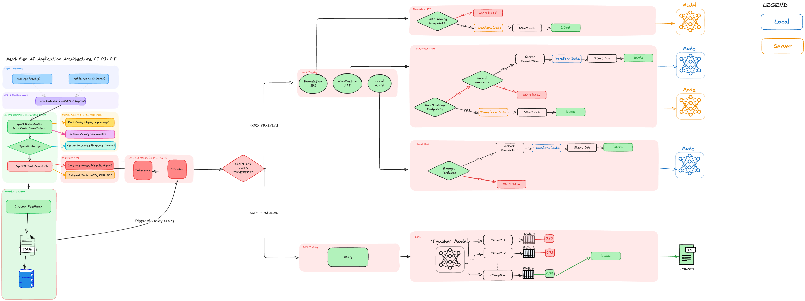

<p align="center">
  
</p>

<h1 align="center">Kaizen</h1>

<p align="center">
  <strong>Continuous improvement for AI applications — prompts and models.</strong><br/>
  Collect feedback, auto-optimize prompts with DSPy, fine-tune models, deliver as reviewable PRs.
</p>

<p align="center">
  <a href="#quick-start">Quick Start</a> &nbsp;&bull;&nbsp;
  <a href="https://emirhan-gazi.github.io/kaizen/">Documentation</a> &nbsp;&bull;&nbsp;
  <a href="#architecture">Architecture</a> &nbsp;&bull;&nbsp;
  <a href="#sdk-usage">SDK Usage</a> &nbsp;&bull;&nbsp;
  <a href="#roadmap">Roadmap</a>
</p>

---

Most AI teams improve their systems manually — editing prompts, collecting datasets, running training jobs, hoping the new version is better. Kaizen automates this entire loop.

```
                              ┌──── Soft Training ──── Optimized Prompt ──── PR
Your App ──feedback──> Kaizen ┤
                              └──── Hard Training ──── Fine-tuned Model ──── Deploy
```

**Soft Training** (available now): DSPy-based prompt optimization. Your existing prompt is refined incrementally based on real user feedback. Results are delivered as reviewable pull requests.

**Hard Training** (coming soon): Model fine-tuning using the same feedback data. When prompt optimization hits a ceiling, Kaizen can fine-tune the underlying model via foundation API endpoints (OpenAI, Gemini), vLLM, or local training infrastructure.

No other tool closes both loops. Most stop at observation or evaluation. Kaizen goes all the way to automated optimization with human-in-the-loop delivery.

## How It Works

<p align="center">
  
  <br/>
  <em>Full interactive version: <a href="idea.excalidraw">idea.excalidraw</a> (open with <a href="https://excalidraw.com">excalidraw.com</a>)</em>
</p>

**1. Instrument your app** with the Python SDK — one line per LLM call:

```python
import kaizen_sdk as kaizen

result = await kaizen.trace("summarize_ticket", chain.ainvoke, inputs)
```

**2. Users give feedback** — thumbs up/down, star ratings, or programmatic scores:

```python
await kaizen.flush(score=0.9)  # sends all buffered traces with score
```

**3. Kaizen auto-optimizes** — when feedback crosses the threshold, DSPy MIPROv2 runs automatically. It seeds from your existing prompt and makes small, conservative refinements.

**4. Review the PR** — the optimized prompt lands as a pull request with:
- Before/after prompt diff
- Dataset score + independent LLM judge score
- Cost and token usage breakdown
- Job metadata and DSPy version

**5. Merge and ship** — your app automatically uses the new prompt.

## Quick Start

### 1. Start the stack

```bash
git clone <repo-url> kaizen && cd kaizen
cp .env.example .env    # edit with your LLM API key
podman-compose up -d    # or docker compose up -d
```

### 2. Open the dashboard

Go to [http://localhost:3000](http://localhost:3000) — click **Generate API Key** on first visit.

### 3. Integrate the SDK

```bash
pip install kaizen-sdk
```

```python
import kaizen_sdk as kaizen

# Initialize once at startup
kaizen.init(
    api_key="kaizen_...",
    base_url="http://localhost:8000",
    git_provider="github",               # or bitbucket_server, gitlab
    git_repo="your-org/your-repo",
    git_base_branch="main",
    git_token="ghp_...",
    feedback_threshold=5,                 # auto-optimize after 5 feedback entries
    teacher_model="openai/gpt-4o",
    judge_model="openai/gpt-4o-mini",
)

# Trace LLM calls — replaces your chain call AND captures feedback
result = await kaizen.trace("summarize_ticket", chain.ainvoke, {
    "ticket_text": "Server is down",
    "priority": "high",
})

# When user gives feedback — flush all buffered traces with score
await kaizen.flush(score=0.85)

# Get the optimized prompt (after optimization completes)
prompt = await kaizen.get_prompt("summarize_ticket")
```

That's it. No task registration, no config files, no UUIDs. Tasks are auto-created on first feedback.

## SDK Usage

### Core API (4 functions)

| Function | Description |
|----------|-------------|
| `kaizen.init(...)` | Initialize SDK with API key, git config, and optimization defaults |
| `kaizen.trace(name, fn, inputs)` | Run an LLM call, capture input/output, buffer for scoring |
| `kaizen.flush(score)` | Send all buffered traces to Kaizen with the user's score |
| `kaizen.get_prompt(name)` | Get the active optimized prompt for a task |

### Per-task overrides

```python
# Different threshold or model for a specific task
result = await kaizen.trace(
    "complex_analysis",
    chain.ainvoke,
    inputs,
    feedback_threshold=20,        # needs more data
    teacher_model="openai/gpt-4o",
    prompt_file="src/prompts/analysis.py",
    prompt_locator="ANALYSIS_PROMPT",
)
```

### SSE streaming support

```python
kaizen.reset_buffer()                      # at request start
# ... trace calls during request ...
interactions = kaizen.get_buffered_traces() # for SSE metadata
```

### Environment variables

| Variable | Default | Description |
|----------|---------|-------------|
| `KAIZEN_API_KEY` | — | API key |
| `KAIZEN_BASE_URL` | `http://localhost:8000` | Server URL |
| `KAIZEN_GIT_PROVIDER` | — | `github`, `bitbucket_server`, or `gitlab` |
| `KAIZEN_GIT_REPO` | — | Target repository |
| `KAIZEN_GIT_TOKEN` | — | Git personal access token |
| `KAIZEN_GIT_BASE_BRANCH` | — | PR target branch |
| `KAIZEN_GIT_BASE_URL` | — | Git server URL (Bitbucket/GitLab) |
| `KAIZEN_GIT_PROJECT` | — | Bitbucket project key |

## Architecture

```
                         ┌─────────────┐
                         │  Your App   │
                         │ kaizen_sdk  │
                         └──────┬──────┘
                                │ feedback + traces
                         ┌──────▼──────┐
                    ┌────│  FastAPI     │────┐
                    │    │  API :8000   │    │
                    │    └──────────────┘    │
              ┌─────▼─────┐          ┌──────▼──────┐
              │ PostgreSQL │          │    Redis     │
              │ feedback   │          │ cache +      │
              │ prompts    │          │ job broker   │
              │ jobs       │          └──────┬──────┘
              └────────────┘                 │
                                      ┌──────▼──────┐
                                      │   Celery     │
                                      │   Worker     │
                                      │  DSPy +      │
                                      │  LiteLLM     │
                                      └──────┬──────┘
                               ┌─────────────┼─────────────┐
                         ┌─────▼─────┐ ┌─────▼─────┐ ┌─────▼─────┐
                         │  GitHub   │ │ Bitbucket │ │  GitLab   │
                         │  Auto-PR  │ │  Auto-PR  │ │  Auto-PR  │
                         └───────────┘ └───────────┘ └───────────┘
```

### Services

| Service | Port | Description |
|---------|------|-------------|
| **api** | 8000 | FastAPI REST API |
| **dashboard** | 3000 | Next.js web UI |
| **worker** | — | Celery DSPy optimization worker |
| **beat** | — | Celery Beat scheduler |
| **postgres** | 5432 | Durable storage |
| **redis** | 6379 | Job queue + prompt cache |
| **flower** | 5555 | Celery monitoring |
| **docs** | 4000 | Documentation site |

## Optimization Pipeline

### How it works

1. Feedback entries split **20/80** train/validation (DSPy's recommended split)
2. **Existing prompt is loaded** from your repo and used as the seed — MIPROv2 refines rather than rewrites
3. **Conservative optimization** — minimal few-shot examples, instruction-focused changes
4. **Dual scoring** — dataset metric score + independent LLM-as-judge score
5. Optimized prompt saved as `draft` with full DSPy state as portable JSON
6. **Auto-PR** created with diff, scores, and metadata
7. Prompt stays `draft` until you merge or activate via API

### Evaluator types

| Type | Description |
|------|-------------|
| `judge` | LLM-as-judge with 3-call majority vote, randomized ordering, anti-verbosity bias |
| `exact_match` | Deterministic string comparison |
| `custom_fn` | Your Python function: `(inputs, output, expected) -> float` |
| `composite` | Weighted combination: `{"judge": 0.7, "exact_match": 0.3}` |

### Prompt file formats

| Format | Extension | How prompts are found |
|--------|-----------|----------------------|
| Python | `.py` | AST-based variable extraction |
| YAML | `.yaml` | Dot-path key traversal |
| JSON | `.json` | Dot-path key traversal |
| Text | `.txt` | Entire file is the prompt |

## Dashboard

The web dashboard at [http://localhost:3000](http://localhost:3000) provides:

- **Task overview** — feedback count, threshold progress, active prompt score
- **Jobs tab** — optimization status, duration, retry PR button, error details
- **Prompts tab** — version history with GitHub-style diff between versions, dual scores
- **Trigger optimization** — manual optimization from the UI
- **Settings** — API key management (generate, revoke)
- **Score trend** — chart of prompt performance over time

## REST API

All endpoints require `X-API-Key` header except `/health` and `/api/v1/keys/status`.

| Method | Endpoint | Description |
|--------|----------|-------------|
| GET | `/health` | Health check |
| POST | `/api/v1/tasks/` | Create task |
| GET | `/api/v1/tasks/` | List tasks |
| DELETE | `/api/v1/tasks/{id}` | Delete task + all data |
| POST | `/api/v1/feedback/` | Submit feedback (auto-creates task by name) |
| POST | `/api/v1/optimize/{task_id}` | Trigger optimization |
| GET | `/api/v1/prompts/{task_id}` | Get active prompt |
| GET | `/api/v1/prompts/{task_id}/versions/` | List prompt versions |
| GET | `/api/v1/jobs/{job_id}` | Job status |
| POST | `/api/v1/jobs/{job_id}/retry-pr` | Retry failed PR |
| POST | `/api/v1/keys/bootstrap` | Generate first API key (no auth) |
| POST | `/api/v1/keys/` | Create API key |
| DELETE | `/api/v1/keys/{id}` | Revoke API key |

Full API documentation at [emirhan-gazi.github.io/kaizen](https://emirhan-gazi.github.io/kaizen/).

## Server Configuration

| Variable | Default | Description |
|----------|---------|-------------|
| `DATABASE_URL` | `postgresql+psycopg://...` | PostgreSQL connection |
| `REDIS_URL` | `redis://localhost:6379/0` | Redis connection |
| `OPENAI_API_KEY` | — | LLM provider API key |
| `OPENAI_API_BASE` | — | Custom LLM endpoint (OpenAI-compatible) |
| `TEACHER_MODEL` | `gpt-4o` | Model for prompt optimization |
| `JUDGE_MODEL` | `gpt-4o-mini` | Model for evaluation scoring |
| `MAX_TRIALS_DEFAULT` | `15` | MIPROv2 optimization trials |
| `COST_BUDGET_DEFAULT` | `5.0` | Max USD per optimization run |
| `GIT_TOKEN_ENCRYPTION_KEY` | — | Fernet key for encrypting git tokens |

## Tech Stack

- **Python 3.12** + FastAPI + Celery + SQLAlchemy 2.0
- **DSPy** — prompt optimization engine (MIPROv2)
- **LiteLLM** — multi-provider LLM routing
- **PostgreSQL 16** — durable storage
- **Redis 7.4** — job queue + prompt cache
- **Next.js 14** + Tailwind + shadcn/ui — dashboard
- **Nextra** — documentation site

## Roadmap

Kaizen has two training modes. Soft training (prompt optimization) is available now. Hard training (model fine-tuning) is on the roadmap.

### Soft Training (Prompt Optimization)

- [x] DSPy MIPROv2 prompt optimization
- [x] Existing prompt seeding (refine, not rewrite)
- [x] Dual scoring (dataset + LLM judge)
- [x] Auto-PR to GitHub, Bitbucket Server
- [x] SDK with `kaizen.trace()` / `kaizen.flush()`
- [x] Dashboard with prompt diff, job monitoring, key management
- [ ] LLM-based prompt refinement (alternative to DSPy for more controlled changes)
- [ ] A/B testing between prompt versions
- [ ] Prompt version rollback

### Hard Training (Model Fine-tuning)

- [ ] Training data export from feedback (JSONL, Alpaca, ShareGPT formats)
- [ ] Foundation API fine-tuning (OpenAI, Google Gemini, Anthropic)
- [ ] vLLM / custom API fine-tuning integration
- [ ] Local model training (LoRA/QLoRA via Hugging Face)
- [ ] Training job orchestration and monitoring
- [ ] Model evaluation pipeline (before/after benchmarks)
- [ ] Automatic model deployment after training
- [ ] Hardware requirement detection and routing

### Platform

- [ ] GitLab Auto-PR support
- [ ] CI workflow for PR checks (pytest + ruff)
- [ ] PyPI package publishing for kaizen-sdk
- [ ] Webhook-based prompt activation on PR merge
- [ ] Multi-tenant support
- [ ] Cost tracking and budgeting dashboard

## Security

- API keys are SHA-256 hashed — plaintext never stored
- Git tokens are Fernet-encrypted at rest
- GitHub webhooks validated via `X-Hub-Signature-256`
- No telemetry, no external calls except your configured LLM and git provider

## License

MIT
